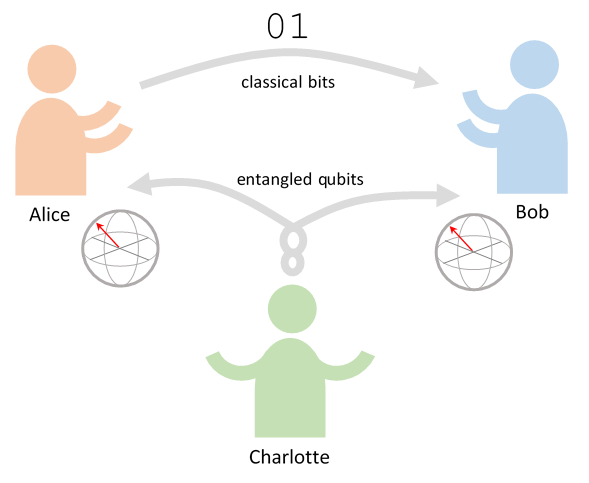

```{r setup, include=FALSE}
knitr::opts_chunk$set(echo = FALSE)
```

```{r echo=FALSE, message=FALSE, results='asis'}
cat(
  "<script src='https://cdn.jsdelivr.net/npm/vue@2.6.12'></script>",
  "<script src='https://unpkg.com/quantum-tensors@0.4.13/dist/quantum-tensors.min.js'></script>",
  "<script src='https://unpkg.com/bra-ket-vue@0.3.1/dist/bra-ket-vue.min.js'></script>"
)
```

# Introduction

Alice wants to send information to her friend Bob and she wants to do it in the form of a quantum state, which she can do using the qubit state:

$$ |\psi \rangle = \alpha |0\rangle + \beta |1\rangle $$

with this she will be able to send Bob information in $\alpha$ and $\beta$.

The quantum mechanics theorem of non-cloning indicates that it is not possible to generate an exact copy of an unknown quantum state. As a result of this we can see that Alice cannot just copy $|\psi\rangle$ and give that copy to Bob. We can only copy classic states (not superpositions).

However, by taking advantage of two classical bits and a pair of entangled quibits, Alice can transfer her state $|\psi\rangle$ to Bob. This protocol is called teleportation because eventually Bob will have $|\psi\rangle$ and Alice will no longer have it [@Nielsen16].


# Quantum Teleportation Protocol

To transfer a qubit, Alice and Bob must rely on a third party (Charlotte) to send them a pair of entangled qubits (one qubit to Alice and the other to Bob). Alice then performs some operations on her qubit, sends the results to Bob through a classic communication channel, and Bob then performs some other operations on his end to receive Alice's qubit and thus decipher the message.


```{r, out.width = "70%", fig.align="center"}

```


Next we are going to review the steps that constitute the teleportation protocol, and see how they are implemented using [QuantumTensors](https://github.com/Quantum-Game/quantum-tensors) and its visualization by using $\langle\phi|\psi\rangle$.vue (more details [here](https://github.com/Quantum-Game/bra-ket-vue)). 

We'll create a quantum circuit and apply the necessary quantum gates.


### Step 1

Quantum teleportation begins with the fact that Alice needs to send $|\psi\rangle = a|0\rangle + b|1\rangle$ (a random qubit) to Bob. She does not know the state of the qubit to send. For this, Alice and Bob request the help of a third party: Charlotte, who prepares a pair of entangled qubits that she will give one to Bob and the other to Alice.

The entangled pair that Charlotte creates is a special pair called **Bell pair**, which, in Dirac notation, is written as:

$$|\Phi^+\rangle=\tfrac{1}{\sqrt{2}}\big(|00\rangle + |11\rangle\big)$$

In the language of quantum circuits, the way to create such a pair between two qubits is to place the first one in the base X ($|+\rangle$ and $|-\rangle$) using a Hadamard gate, and then applying a $CNOT$ gate to the second qubit, controlled by the base X.

```{js, echo=TRUE, eval=TRUE}
const { Circuit } = QuantumTensors;

const circuitHistory = [];
circ = Circuit.qubits(3)
  .X(0).H(0)                //initialize |psi>
  .saveTo(circuitHistory)
  .H(1)                     // preparte Bell state
  .saveTo(circuitHistory)
  .CNOT(1, 2)
  .saveTo(circuitHistory);
```

<br>

In the above code, a circuit with 3 qubits is created, and a Hadamard gate is applied to the second qubit and the $CNOT$ gate is controlled by the second qubit and its target is the third qubit. The Bell pair has been achived.

In this configuration, in the qubit in position $0$ is the state $|\psi\rangle$, which contains the information that Alice wants to send to Bob. In this example we are setting:

$$|\psi\rangle=\tfrac{1}{\sqrt{2}}\big(|0\rangle -|1\rangle\big)$$

Charlotte is in charge of sending the second qubit (position $1$) to Alice and the third qubit (position $2$) to Bob. After this, Alice and Bob go their separate ways (as far as they want).

Thus, Alice and Bob each own one qubit of the entangled pair (denoted $A$ and $B$ respectively):

$$|\Phi^+\rangle=\tfrac{1}{\sqrt{2}}\big(|0\rangle_A|0\rangle_B+|1\rangle_A|1\rangle_B\big)$$


Thus, the 3-qubit quantum system (generated in the previous circuit), where Alice has the first two qubits and Bob has the last one, is written as follows:

$$
\begin{align*} 
|\psi\rangle\otimes|\Phi^+\rangle &= \tfrac{1}{\sqrt{2}}\big( a|0\rangle\otimes\big(|00\rangle+|11\rangle\big)+b|1\rangle\otimes\big(|00\rangle+|11\rangle\big) \big)\\ 
&= \tfrac{1}{\sqrt{2}}\big( a|000\rangle +a|011\rangle + b|100\rangle + b|111\rangle \big)
\end{align*}
$$

### Step 2

Now Alice, according to the protocol, applies a $CNOT$ gate to her two qubits: where the target is qubit $1$ (her entangled qubit), and the control is $|\psi\rangle$ (position $0$), which is the qubit that she wants to send to Bob [@Laflamme07].

Alice then applies a Hadamard gate to $|\psi\rangle$.

This is written as:

$$
\begin{align*} 
\big(H\otimes I\otimes I\big)\big(CNOT\otimes I\big)\big(|\psi\rangle\otimes|\Phi^+\rangle\big) 
&= \big(H\otimes I\otimes I\big)\big(CNOT\otimes I\big)\tfrac{1}{\sqrt{2}}\big( a|000\rangle +a|011\rangle + b|100\rangle + b|111\rangle \big)\\ 
&= \big(H\otimes I\otimes I\big)\tfrac{1}{\sqrt{2}}\big( a|000\rangle +a|011\rangle + b|110\rangle + b|101\rangle \big)\\
&= \tfrac{1}{2}\big( a\big(|000\rangle+|011\rangle+|100\rangle+|111\rangle\big) + b\big(|010\rangle+|001\rangle-|110\rangle-|101\rangle\big) \big)
\end{align*}
$$
Which can be separated and written as:

$$
\begin{align*} 
= \tfrac{1}{2}&\big( \; \; |00\rangle\big(a|0\rangle+b|1\rangle\big)\\
&+ |01\rangle\big(a|1\rangle+b|0\rangle\big)\\
&+ |10\rangle\big(a|0\rangle-b|1\rangle\big)\\
&+ |11\rangle\big(a|1\rangle-b|0\rangle\big)  \; \; \big)
\end{align*}
$$

Let's apply these gates in our circuit:


```{js, echo=TRUE, eval=TRUE}

circ = circ.CNOT(0, 1)
  .saveTo(circuitHistory)
  .H(0)
  .saveTo(circuitHistory);
```

<br>


### Step 3

Now, Alice measures the first two qubits (which she has): $|\Phi^+_A\rangle$ and $|\psi\rangle$; and she stores her result in two classic bits, which she sends to Bob. The result she gets is always one of the four states of the standard base: $|00\rangle$, $|01\rangle$, $|10\rangle$, $|11\rangle$ with same probability.

On the basis of Alice's measurement, Bob's state will be projected to:

$$ |00\rangle\rightarrow \big(a|0\rangle+b|1\rangle\big)$$
$$ |01\rangle\rightarrow \big(a|1\rangle+b|0\rangle\big)$$
$$ |10\rangle\rightarrow \big(a|0\rangle-b|1\rangle\big)$$
$$ |11\rangle\rightarrow \big(a|1\rangle-b|0\rangle\big)$$

Let's measure from our circuit Alice's qubits:

```{js, echo=TRUE, eval=TRUE}

var measure0 = circ.measureQubit(0);
var partialState_2q;
var bit0;
if(measure0[0].probability > measure0[1].probability) {
  partialState_2q = measure0[0].newState
  bit0 = measure0[0].measured
} else {
  partialState_2q = measure0[1].newState
  bit0 = measure0[1].measured
}


var measure1 = partialState_2q.measureQubit(0);
var partialState_1q;
var bit1;
if(measure1[0].probability > measure1[1].probability) {
  partialState_1q = measure1[0].newState
  bit1 = measure1[0].measured
} else {
  partialState_1q = measure1[1].newState
  bit1 = measure1[1].measured
}
```

<br>

### Step 4

Now Bob when receiving the bits from Alice, he knows that he can get the original state $|\psi\rangle$ by applying proper transformations on his qubit (position $2$) which is part of the entangled pair.

Bob applies the following gates, depending on the classic bits he received from Alice:


| Bob State | Classic bits he gets | Quantum gates that he must apply |
|:---------:|:--------------------:|:--------------------------------:|
| $\big(a|0\rangle+b|1\rangle\big)$ | $00$ | $I$ |
| $\big(a|1\rangle+b|0\rangle\big)$ | $01$ | $X$ |
| $\big(a|0\rangle-b|1\rangle\big)$ | $10$ | $Z$ |
| $\big(a|1\rangle-b|0\rangle\big)$ | $11$ | $ZX$ |


After this step, Bob will have deciphered the status that Alice sent him.

Let's apply the appropriate gates to Bob's qubit:


```{js, echo=TRUE, eval=TRUE}
if(bit1 == '1'){
  partialState_1q = partialState_1q.X(0);
}

if(bit0 == '1'){
  partialState_1q = partialState_1q.Z(0);
}

partialState_1q.saveTo(circuitHistory)
```

<br>

At the end of the protocol, Alice's qubit has been teleported to Bob's.

The $|\psi\rangle$ qubit (position $0$) information is now in Bob's qubit (position $2$).


Let's see the states after each step:

<br>

<div id='ketlist'></div>

<br>
<br>

We can see, that the last state in Bob's qubit, is the expected state:

$$|\Phi^+_B\rangle=c\big(|0\rangle -|1\rangle\big) \sim |\psi\rangle$$
<br>
<br>
<br>

```{js, results='asis', echo=FALSE, message=FALSE}

const { KetListViewer } = BraKetVue;

new Vue({
  el: '#ketlist',
  template: "<ket-list-viewer :steps='stepsQuantumComputing' :dark-mode='false'/>",
  components: {
    KetListViewer,
  },
  data() {
	  return {
      stepsQuantumComputing: [
        { value: 'Initial state', vector: circuitHistory[0].vector },
        { value: 'Step 1', vector: circuitHistory[2].vector },
        { value: 'Step 2', vector: circuitHistory[4].vector },
        { value: 'Step 3 partialState (2 qubits)', vector: partialState_2q.vector },
        { value: 'Step 3 partialState (1 qubit)', vector: partialState_1q.vector },
        { value: 'Step 4 (Teleported state to Bob)', vector: circuitHistory[5].vector },
      ],
	  }
  }
})

```
