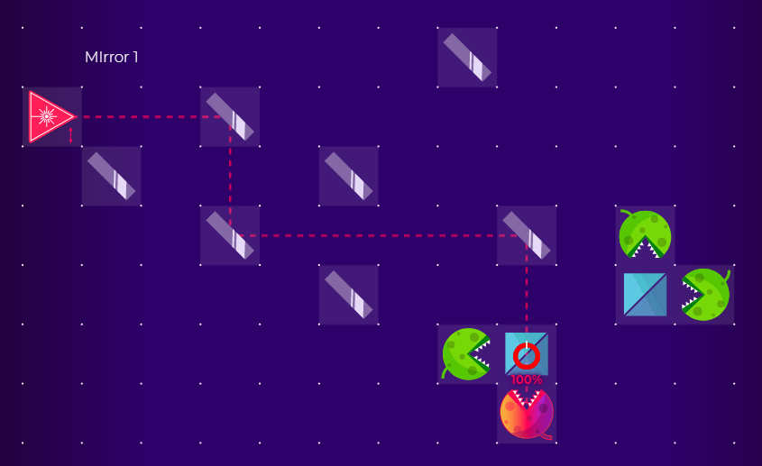

```{r setup, include=FALSE}
knitr::opts_chunk$set(echo = TRUE)
```

### Introduction

This is a proof of concept (POC) of the use of the **&#60;iframe&#62;** or **&#60;embed&#62;** tags to include a virtual lab to help explain concepts.


### Path "1" with polarization $H$: $\left(|10\rangle\right)$

Below, the setup that allows us to generate the path "1" with polarization $H$ is shown, that is, the state $|10\rangle$

<div style="text-align: center;">
<div id="my-div">
<embed src="https://lab.quantumflytrap.com/u/clausia/Umkc8nYtQ9OpN7T1xNKjcA" id="my-iframe" scrolling="no"></embed>
</div>
</div>


### Path "0" with polarization $H$: $\left(|00\rangle\right)$

To generate the path "0" it is necessary to change the path, for this you must remove *mirror 1* from the path, try to drag this mirror in the setup above to another position so that it does not get in the way.

<button style="width: 20%;" id="btnAns" onclick="showAnswer()">Show answer</button>


<div id="answer" style="display: none;">

</div>


```{js, results='asis', echo=FALSE, message=FALSE}
var showAnswer = function() {
  if( $('#answer').css('display') == 'block' ) {
    $('#answer').css('display', 'none');
    $('#btnAns').html('Show answer');
  } else {
    $('#answer').css('display', 'block');
    $('#btnAns').html('Hide answer');
  }
}
```


```{css, echo=FALSE}
#my-div {
  width    : 665px;
  height   : 400px;
  overflow : hidden;
  position : relative;
}

#my-iframe {
  position : absolute;
  top      : -115px;
  left     : -220px;
  width    : 1150px;
  height   : 1150px;
}
```